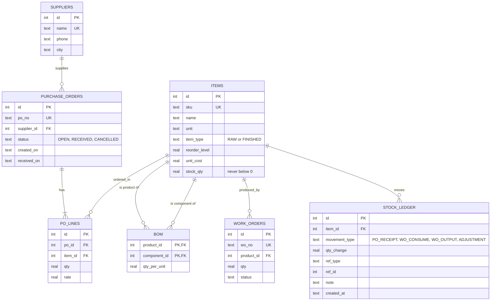
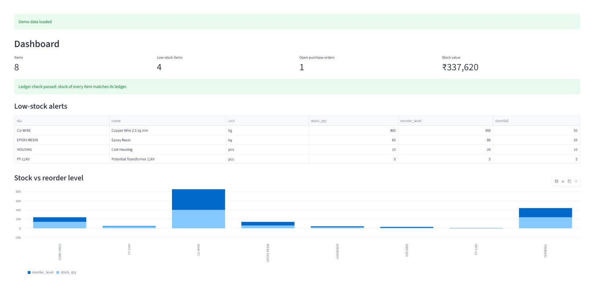
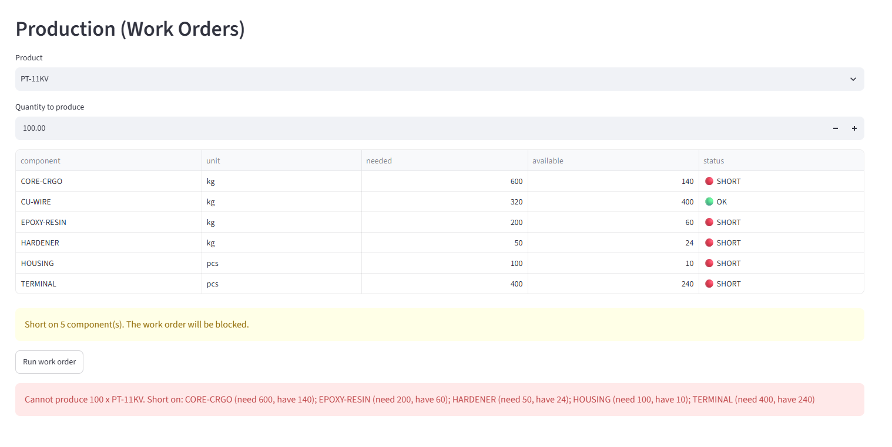

# Mini ERP for a Small Manufacturer

A Python + SQLite application that automates the core flow of an ERP for a small electrical
equipment maker (current transformers, potential transformers): **purchase orders, bill of
materials (BOM), production, and a full stock ledger.** Includes validated CSV import,
Excel reports, a daily job, and a read-only JSON API.

```
Supplier -> Purchase Order -> Receive Goods -> Stock (raw material)
                                                   |
                                  BOM + Work Order (blocked if stock is short)
                                                   |
                                         Stock (finished goods) -> Reports / API
```

## Features
- **Master data:** items (RAW / FINISHED), suppliers, reorder levels
- **Purchase flow:** create PO, then receive goods (stock goes up)
- **BOM:** define a product as a list of components with quantities
- **Production:** work order consumes BOM components and adds finished goods; **blocked if any component is short** (error lists every missing item)
- **Stock ledger:** every movement is logged, so stock can be recalculated and audited (`verify` command)
- **Low-stock alert** report and **stock valuation** (qty x last purchase rate)
- **CSV import with validation:** good rows load, bad rows are rejected with a reason and saved to an error report
- **Excel report** (Stock, Low Stock, Valuation, Purchase Summary) and **JSON export**
- **Daily job:** saves the Excel report and logs low-stock items (schedule with Windows Task Scheduler or cron)
- **Streamlit dashboard:** metrics, low-stock alerts, create/receive POs, run work orders with a live shortage preview, ledger view, master data forms, report downloads and CSV import
- **FastAPI endpoints** returning stock data as JSON
- Logging to `mini_erp.log`, 44 automated tests

## Tech
Python 3, `sqlite3`, Streamlit (dashboard), argparse (CLI), openpyxl, FastAPI, logging, pytest

## Design decisions (what makes it reliable)
- **Transactions:** every operation runs in one all-or-nothing transaction. If anything fails, everything rolls back, so stock is never half-updated.
- **One place changes stock:** a single function updates the item and writes the ledger row together, so stock and ledger cannot drift apart.
- **Database constraints:** `CHECK (stock_qty >= 0)`, `UNIQUE` SKUs, `FOREIGN KEY`s (enforced), status checks, BOM self-reference blocked.
- **Audit:** `verify` recomputes stock from the ledger and flags any mismatch.
- **Costing:** valuation uses the last purchase rate (simple and easy to explain; weighted average is a possible upgrade).

## ER diagram


## Setup (Windows PowerShell)
```powershell
cd mini-erp
python -m venv .venv
.\.venv\Scripts\Activate.ps1
pip install -r requirements.txt
python -m pytest            # 44 tests should pass
```

## Dashboard (Streamlit)
```powershell
streamlit run dashboard.py
```
Opens at http://localhost:8501. On an empty database click **Load demo data**. Pages:
- **Dashboard:** key numbers, low-stock alerts, stock vs reorder chart, ledger check
- **Purchase Orders:** create a PO, receive goods, cancel
- **Production:** pick a product and quantity, see needed vs available per component, run the work order (blocked with a clear message if stock is short)
- **Stock & Ledger:** current stock and full movement history
- **Master Data:** add suppliers, items, BOM lines, opening stock
- **Reports & Import:** download Excel/JSON, import a CSV with validation

The dashboard and the CLI use the same business logic, so every rule (transactions, stock checks) applies in both.

## Quick start with demo data (CLI)
```powershell
python -m mini_erp --db demo.db demo
python -m mini_erp --db demo.db stock
python -m mini_erp --db demo.db low-stock
python -m mini_erp --db demo.db work-order PT-11KV 100    # blocked: shows every short component
python -m mini_erp --db demo.db ledger --sku CU-WIRE
python -m mini_erp --db demo.db verify
python -m mini_erp --db demo.db export-excel
python -m mini_erp --db demo.db daily-job
```

### Sample output
```
> python -m mini_erp --db demo.db work-order PT-11KV 100
Error: Cannot produce 100 x PT-11KV. Short on: CORE-CRGO (need 600, have 140); EPOXY-RESIN (need 200, have 60); HARDENER (need 50, have 24); HOUSING (need 100, have 10); TERMINAL (need 400, have 240)

> python -m mini_erp --db demo.db ledger --sku CU-WIRE
ID  CREATED_AT           SKU      MOVEMENT_TYPE  QTY_CHANGE  NOTE
1   2026-10-08 14:39:44  CU-WIRE  PO_RECEIPT     500         PO-0001
8   2026-10-08 14:39:44  CU-WIRE  WO_CONSUME     -100        WO-0001

> python -m mini_erp --db demo.db verify
OK: stock of every item matches its ledger.
```
More examples are in `sample_output/` (Excel report, JSON, import error report).

## Build your own data
```powershell
python -m mini_erp add-supplier "Shree Metals" --city Waluj
python -m mini_erp add-item CU-WIRE "Copper Wire" --unit kg --type RAW --reorder 450
python -m mini_erp add-item CT-11KV "Current Transformer 11kV" --type FINISHED --reorder 10
python -m mini_erp add-bom CT-11KV CU-WIRE 2.5
python -m mini_erp create-po "Shree Metals" --line CU-WIRE:500:720
python -m mini_erp receive-po PO-0001
python -m mini_erp work-order CT-11KV 40
python -m mini_erp import-items sample_data/items_messy.csv   # see validation in action
```
Run `python -m mini_erp --help` for all commands.

## JSON API
```powershell
$env:MINI_ERP_DB = "demo.db"
uvicorn mini_erp.api:app --reload
```
Open http://127.0.0.1:8000/docs. Endpoints: `/health`, `/stock`, `/stock/{sku}`, `/low-stock`, `/valuation`, `/purchase-summary`, `/ledger?sku=CU-WIRE`

## Project structure
```
dashboard.py    Streamlit dashboard
mini_erp/
  db.py         schema, constraints, transaction helper
  inventory.py  business logic (PO, BOM, work order, ledger, CSV import)
  reports.py    queries, Excel/JSON export, daily job
  api.py        FastAPI endpoints
  cli.py        command-line interface
  demo.py       demo data loader
tests/          44 pytest tests (stock logic, import, reports, API, dashboard)
sample_data/    clean and messy CSV files
sample_output/  example Excel, JSON and error report
```

## Screenshots
<!-- Add after you run the demo, then remove this comment:



-->

## Possible next steps
- Connect the Vendor Bill Digitizer so scanned bills create purchase orders
- Weighted-average costing, PDF purchase orders, email alerts
